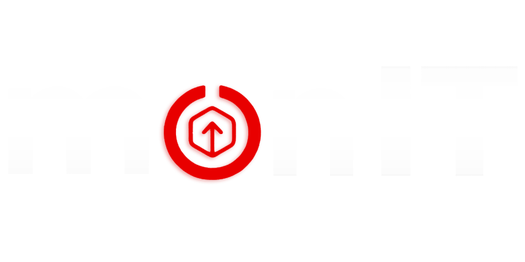
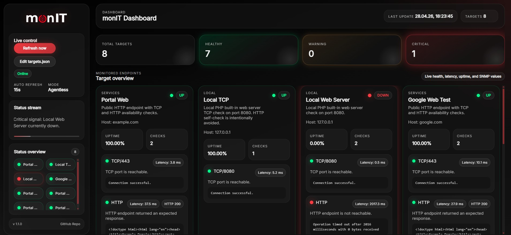
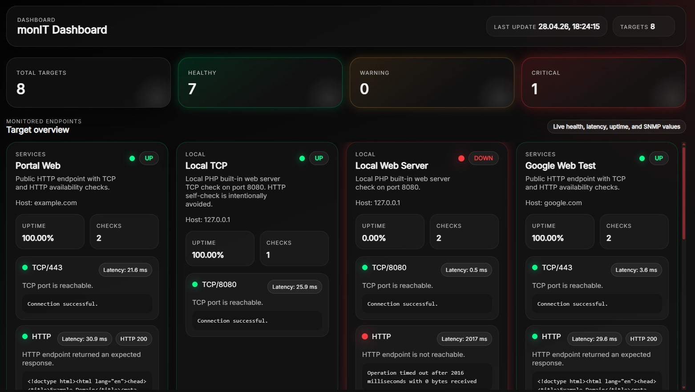
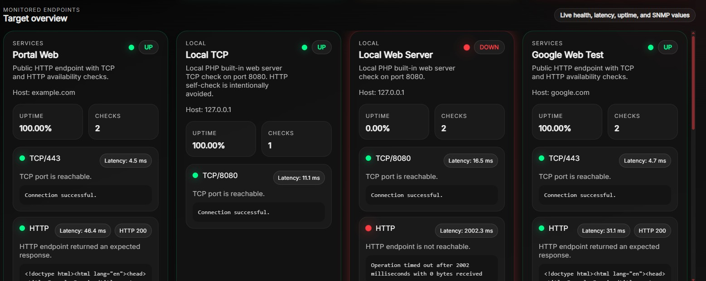
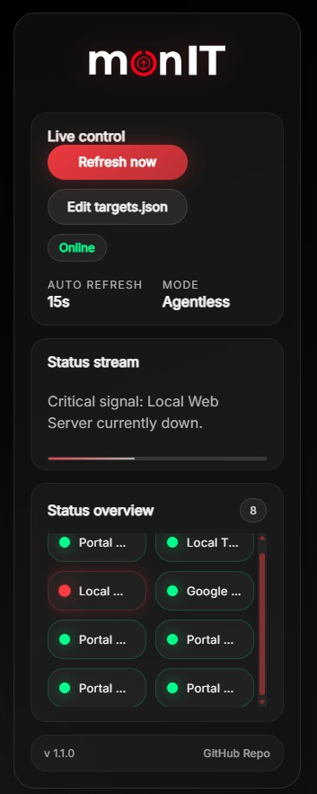

# monIT

**monIT** is a lightweight, local, browser-based monitoring dashboard for small internal environments, kiosk displays, workshop systems, wall monitors, or simple admin overview screens.

It is intentionally simple:

- no database
- no agent installation on monitored targets
- no large monitoring stack
- PHP backend
- JSON configuration
- Bootstrap-like dark web dashboard
- local Net-SNMP binary integration
- cache-first dashboard API
- separate background polling loop
- optional kiosk-style auto-scroll

The project is designed to run locally on a Windows machine and expose a dashboard at:

```text
http://127.0.0.1:8080
```

The intended use case is a small passive monitoring screen that can run unattended on a Windows 10/11 kiosk or dashboard PC.

---

## Features

monIT currently supports:

- agentless TCP port checks
- agentless HTTP/HTTPS endpoint checks
- optional ICMP checks
- optional SNMP checks through Net-SNMP binaries
- local JSON-based target configuration
- cache-first dashboard API
- separate polling loop for stable kiosk operation
- live browser dashboard
- auto-refresh
- target cards with status, latency, uptime and check details
- compact Status Overview card
- status stream panel with progress bar
- compact dark UI with red warning/critical accents
- favicon and logo support
- local `targets.json` editor button
- local Clear runtime cache button
- optional kiosk auto-scroll for the target overview
- optional Status Overview auto-scroll
- local cache, history and progress logging

Status states:

| State | Meaning |
|---|---|
| `UP` | Target/check is healthy |
| `WARNING` | Degraded or partially problematic state |
| `DOWN` | Target/check is unreachable or failed |

---

## Previews






---

## What monIT is not

monIT is not intended to replace full monitoring platforms such as Zabbix, PRTG, Icinga, Checkmk, Grafana stacks, or enterprise observability tools.

It is a compact local dashboard for simple visibility.

Good use cases:

- wall display
- kiosk monitor
- quick internal service overview
- small server/service checks
- workshop or lab dashboard
- lightweight LAN monitoring

Less suitable use cases:

- alert escalation
- long-term reporting
- role-based access
- distributed monitoring
- multi-site architecture
- advanced graphing

---

## Current operating model

monIT now uses a **cache-first dashboard model**.

This is important because the PHP built-in development server is single-threaded. If the dashboard API runs all monitoring checks directly, the web UI can block while DNS, TCP, HTTP, ICMP or SNMP checks are still running.

Recommended operation:

```text
start_server.bat   -> serves the dashboard
poll_loop.bat      -> runs monitoring checks and writes storage/status-cache.json
api/status.php     -> serves the latest cache to the dashboard
```

This keeps the UI responsive even when a target check is slow.

---

## Quickstart

### 1. Extract monIT

Extract the project package, for example:

```text
C:\monIT\
```

Expected project path example:

```text
C:\monIT\start_server.bat
```

---

### 2. Install PHP

Download PHP for Windows and extract it to:

```text
C:\php\
```

The executable must be located here:

```text
C:\php\php.exe
```

---

### 3. Enable required PHP extensions

Create or edit:

```text
C:\php\php.ini
```

Recommended base:

```text
php.ini-production
```

Copy it and rename it to:

```text
php.ini
```

Recommended settings:

```ini
max_execution_time = 120
memory_limit = 256M
default_socket_timeout = 3
display_errors = Off
display_startup_errors = Off
log_errors = On
error_reporting = E_ALL & ~E_DEPRECATED
extension_dir = "C:\php\ext"
extension=curl
extension=openssl
```

Without `curl` / `openssl`, HTTPS checks may fail even when TCP/443 is reachable.

---

### 4. Add Net-SNMP binaries

Place Net-SNMP binaries into:

```text
monIT\bin\
```

Required for SNMP:

```text
monIT\bin\snmpget.exe
```

Optional:

```text
monIT\bin\snmpwalk.exe
```

Depending on the Net-SNMP Windows build, `snmpget.exe` may also require matching DLL files such as `netsnmp.dll` and other runtime DLLs.

Supported runtime layouts:

```text
monIT\bin\snmpget.exe
monIT\bin\snmpwalk.exe
monIT\bin\*.dll
```

or:

```text
monIT\bin\snmpget.exe
monIT\bin\snmpwalk.exe
monIT\bin\bin\*.dll
```

The SNMP runtime paths can also be configured in:

```text
config\app.php
```

Example:

```php
'snmp' => [
    'binary' => __DIR__ . '/../bin/snmpget.exe',
    'walk_binary' => __DIR__ . '/../bin/snmpwalk.exe',
    'runtime_paths' => [
        __DIR__ . '/../bin',
        __DIR__ . '/../bin/bin',
    ],
],
```

---

### 5. Edit targets

Open:

```text
monIT\config\targets.json
```

Add the systems, services, websites, ports, or SNMP devices you want to monitor.

For larger target lists, prefer simple TCP checks first. Add HTTP, ICMP or SNMP only where they are really needed.

---

### 6. Start monIT

Start the web server:

```text
start_server.bat
```

Start the polling loop in a second CMD window:

```text
poll_loop.bat
```

Then open:

```text
http://127.0.0.1:8080
```

---

## Prerequisites

### PHP Installation

Recommended Windows package:

- Source: [Official PHP Downloads for Windows](https://www.php.net/downloads.php?os=windows)
- Version: PHP 8.5.5 ZIP
- Build type: VS17 x64 Non Thread Safe
- SHA256: `107f64f689eec2a0966b4d8a42f0e34e8dfa04c5097c9548e35fb951cba0a464`

Deployment:

1. Download the ZIP package.
2. Extract the contents.
3. Rename the extracted folder to:

```text
php
```

4. Move it directly to:

```text
C:\php\
```

The final structure must look like this:

```text
C:\php\php.exe
C:\php\php.ini
C:\php\ext\
```

---

### Net-SNMP Binaries

Recommended source:

- Source: [Net-SNMP on SourceForge](https://sourceforge.net/projects/net-snmp/)
- Tested with: Net-SNMP v5.5.0
- Higher versions may work if the Windows binaries and DLLs are complete and architecture-compatible.

Required files:

```text
snmpget.exe
```

Optional:

```text
snmpwalk.exe
```

Recommended target path:

```text
monIT\bin\snmpget.exe
monIT\bin\snmpwalk.exe
```

If DLL errors occur, copy the required Net-SNMP DLLs from the same Net-SNMP installation folder into:

```text
monIT\bin\
```

Do not mix x86 and x64 files.

---

### Visual C++ Redistributable 2015–2022

Some PHP and Net-SNMP builds require the Microsoft Visual C++ Redistributable.

Recommended:

- x64: https://aka.ms/vs/17/release/vc_redist.x64.exe
- x86: https://aka.ms/vs/17/release/vc_redist.x86.exe

For this setup, x64 is normally recommended.

---

## Project structure

```text
monIT\
├── bin\
├── cli\
├── config\
├── public\
├── src\
├── storage\
├── start_server.bat
├── poll_loop.bat
├── validate_targets.bat
├── README.md
└── LICENSE.md
```

---

## Folder overview

### `bin\`

This folder contains local external binaries used by monIT.

Typical content:

```text
bin\snmpget.exe
bin\snmpwalk.exe
bin\*.dll
```

or:

```text
bin\snmpget.exe
bin\snmpwalk.exe
bin\bin\*.dll
```

SNMP checks depend on this folder unless you configure absolute paths in `config\app.php`.

---

### `cli\`

Contains command-line scripts.

Main script:

```text
cli\poll.php
```

This runs one monitoring cycle without opening the browser UI.

Manual test:

```cmd
C:\php\php.exe cli\poll.php
```

The current poll script prints useful runtime information:

- project root
- targets file path
- cache file path
- history file path
- target count
- monitoring cycle start
- monitoring cycle duration
- summary
- cache write confirmation

This is the first script to run when troubleshooting.

---

### `config\`

Contains the main configuration files.

Important files:

```text
config\app.php
config\targets.json
config\targets.examples.json
config\targets.server-templates.json
config\targets.kiosk-demo.json
```

#### `app.php`

Controls application behavior:

- app name
- dashboard title
- version
- refresh interval
- kiosk auto-scroll
- Status Overview auto-scroll
- grid layout settings
- Net-SNMP binary paths
- Net-SNMP runtime paths
- storage paths
- UI defaults

Example:

```php
'version' => '1.1.1',
'refresh_interval_seconds' => 15,
'kiosk' => [
    'auto_scroll_enabled' => true,
    'auto_scroll_speed' => 0.50,
    'auto_scroll_pause_seconds' => 3,
    'auto_scroll_start_delay_seconds' => 2,
    'auto_scroll_reset_after_refresh' => false,
    'overview_auto_scroll_enabled' => true,
    'overview_auto_scroll_speed' => 0.36,
    'overview_auto_scroll_pause_seconds' => 2,
    'overview_auto_scroll_start_delay_seconds' => 1,
],
```

#### `targets.json`

This is the main monitoring configuration.

All monitored systems are defined here.

---

### `public\`

This is the web dashboard.

Important files:

```text
public\index.php
public\api\status.php
public\api\open-targets.php
public\api\clear-cache.php
public\assets\css\style.css
public\assets\js\app.js
public\assets\img\logo.png
public\assets\img\favicon.ico
public\assets\img\favicon.png
```

#### `index.php`

Main dashboard page.

This file renders the page shell and passes config values to JavaScript.

#### `api\status.php`

Cache-first backend API endpoint used by the dashboard.

Normal dashboard requests read from:

```text
storage\status-cache.json
```

Manual check:

```text
http://127.0.0.1:8080/api/status.php
```

Expected result: JSON output.

Forced inline monitoring is possible for debugging only:

```text
http://127.0.0.1:8080/api/status.php?refresh=1&inline=1
```

For normal operation, do not rely on inline checks. Use `poll_loop.bat`.

#### `api\open-targets.php`

Local-only endpoint for the `Edit targets.json` button.

It is intentionally restricted to local requests from:

```text
127.0.0.1
::1
```

On Windows it opens:

```text
config\targets.json
```

in Notepad.

#### `api\clear-cache.php`

Local-only endpoint for the `Clear runtime cache` button.

It is intentionally restricted to local requests from:

```text
127.0.0.1
::1
```

It clears runtime files only:

```text
storage\status-cache.json
storage\monitor-progress.log
storage\api-error.log
```

It also resets:

```text
storage\history.json
```

to:

```json
[]
```

After clearing the runtime cache, the dashboard may briefly show no data until `poll_loop.bat` writes a fresh `status-cache.json`.

#### `assets\css\style.css`

Dashboard styling:

- dark mode
- glassmorphism
- card spacing
- target grid layout
- Status Overview styling
- status colors
- logo sizing
- scrollbar styling

#### `assets\js\app.js`

Frontend logic:

- fetches cached monitoring data
- renders target cards
- renders Status Overview
- renders status stream
- controls auto-refresh
- controls auto-scroll
- triggers local targets editor
- triggers Clear runtime cache

---

### `src\`

Contains the PHP monitoring logic.

Main file:

```text
src\Monitor.php
```

This file handles:

- loading `targets.json`
- running checks
- calculating target status
- calculating uptime percentage
- writing history
- writing status cache
- writing monitor progress logs
- returning JSON payloads

The current monitor implementation is optimized for dashboard use:

- TCP checks use subsecond timeouts
- HTTP checks use lightweight HEAD requests
- PHP 8.5 `curl_close()` deprecation is avoided
- progress is written to `storage\monitor-progress.log`
- each target/check is logged during CLI polling

---

### `storage\`

Runtime data folder.

Files:

```text
storage\history.json
storage\status-cache.json
storage\monitor-progress.log
storage\api-error.log
```

#### `history.json`

Stores recent target states.

Used for uptime percentage calculation.

To reset uptime history:

```json
[]
```

#### `status-cache.json`

Stores the last generated monitoring payload.

The dashboard reads from this file through `api/status.php`.

If this file does not exist, the dashboard has no current data until `poll_loop.bat` completes at least one successful polling cycle.

#### `monitor-progress.log`

Progress log written by `src\Monitor.php`.

Useful to identify slow or blocking checks.

The last `CHECK START ...` line without a matching `CHECK DONE ...` line usually points to the problematic target or port.

#### `api-error.log`

Used for API/backend error logging.

---

## Batch files

### `start_server.bat`

Starts the local PHP web server.

Expected URL:

```text
http://127.0.0.1:8080
```

It tries to use PHP from:

```text
runtime\php\php.exe
C:\php\php.exe
php.exe from PATH
```

Recommended setup:

```text
C:\php\php.exe
```

The current server script should start PHP with safer runtime options, for example:

```bat
-d max_execution_time=120
-d default_socket_timeout=5
-d memory_limit=256M
```

---

### `poll_loop.bat`

Runs continuous backend polling in a loop.

This is recommended for kiosk mode and larger target lists.

Current behavior:

1. Changes into the monIT project folder.
2. Finds PHP.
3. Validates `config\targets.json`.
4. Skips polling if JSON is invalid.
5. Runs `cli\poll.php`.
6. Waits for the configured interval.
7. Repeats.

This is the preferred way to keep the dashboard updated.

---

### `validate_targets.bat`

Validates the syntax of:

```text
config\targets.json
```

Use this after editing targets.

This helps catch common JSON mistakes before starting the dashboard.

---

## Status Overview Card

The **Status Overview** card provides a compact high-level view of all configured monitoring targets.

It is designed for kiosk and wall-display scenarios where the detailed target cards may be too large to scan quickly. Each target from `config/targets.json` is rendered as a small status tile with a short label and the same status dot colors used across the dashboard:

| Color | State |
|---|---|
| Green | UP / healthy |
| Orange | WARNING / degraded |
| Red | DOWN / critical |

The card uses the existing target data returned by the monitoring backend. No separate configuration file is required.

Target labels are generated from the available target fields, preferably:

```json
"overview_label": "Core Switch"
```

If `overview_label` is not defined, monIT falls back to `short_name`, `name`, `host`, or `id`.

Example:

```json
{
  "id": "server-file-01",
  "name": "File Server 01",
  "overview_label": "File 01",
  "host": "192.168.10.20",
  "group": "Servers",
  "description": "File server reachability check.",
  "checks": {
    "tcp": {
      "enabled": true,
      "port": 445,
      "timeout_ms": 500
    }
  }
}
```

For many targets, the Status Overview card has its own auto-scroll behavior.

It can be adjusted in:

```text
config\app.php
```

Example:

```php
'kiosk' => [
    'overview_auto_scroll_enabled' => true,
    'overview_auto_scroll_speed' => 0.36,
    'overview_auto_scroll_pause_seconds' => 2,
    'overview_auto_scroll_start_delay_seconds' => 1,
],
'layout' => [
    'overview_grid_columns' => 2,
    'overview_card_max_height_px' => 360,
],
```

---

## Clear runtime cache

The dashboard includes a **Clear runtime cache** button in the Live Control panel.

It is useful when:

- you changed `targets.json`
- the dashboard still shows old targets
- uptime/history should be reset
- the cache file contains stale data
- you want to force a clean polling baseline

The button clears runtime files only:

```text
storage\status-cache.json
storage\monitor-progress.log
storage\api-error.log
```

and resets:

```text
storage\history.json
```

to:

```json
[]
```

The button does not delete configuration files.

It does not delete:

```text
config\targets.json
config\app.php
public\
src\
bin\
```

Important: after clearing the cache, the dashboard may be empty until `poll_loop.bat` completes the next successful polling cycle.

---

## Configuring targets

Targets are configured in:

```text
config\targets.json
```

The file must always be valid JSON.

Important JSON rules:

- Use double quotes, not single quotes.
- Do not add comments.
- Do not leave trailing commas.
- Every object must be separated with a comma.
- Every `{` needs a matching `}`.
- Every `[` needs a matching `]`.
- After editing, validate before polling.

Validate with:

```text
validate_targets.bat
```

or:

```cmd
C:\php\php.exe -r "json_decode(file_get_contents('config/targets.json')); echo json_last_error_msg(), PHP_EOL;"
```

Expected:

```text
No error
```

---

## Target configuration recommendations

For small and stable setups, multiple check types per target are fine.

For larger target lists, start simple:

1. Prefer one TCP check per target.
2. Use short timeouts such as `500` ms for internal LAN systems.
3. Add HTTP checks only for real web endpoints.
4. Add SNMP only where SNMP data is really needed.
5. Avoid large ICMP-only lists on Windows if DNS or ping behavior is slow.
6. Use FQDNs or IP addresses if short hostnames resolve slowly.
7. Add CTX/VDI worker servers only after the core infrastructure list runs reliably.

Recommended simple internal Windows server check:

```json
{
  "id": "server-file-01",
  "name": "server-file-01 (FIL)",
  "overview_label": "FIL",
  "host": "server-file-01",
  "group": "Servers",
  "description": "Windows Server TCP/445 reachability check.",
  "checks": {
    "tcp": {
      "enabled": true,
      "port": 445,
      "timeout_ms": 500
    }
  }
}
```

Recommended website check:

```json
{
  "id": "web-cag",
  "name": "Citrix Gateway (CAG)",
  "overview_label": "CAG",
  "host": "cag.example.local",
  "group": "Websites",
  "description": "Citrix Gateway TCP/443 reachability check.",
  "checks": {
    "tcp": {
      "enabled": true,
      "port": 443,
      "timeout_ms": 1000
    }
  }
}
```

Optional HTTP check:

```json
"http": {
  "enabled": true,
  "url": "https://example.com/",
  "timeout_ms": 2000,
  "expected_status": [200, 301, 302, 401, 403]
}
```

For authentication gateways, `401` or `403` can still mean the web service is reachable.

---

## Target fields

| Field | Required | Description |
|---|---:|---|
| `id` | recommended | Unique technical ID |
| `name` | yes | Display name in the dashboard |
| `overview_label` | recommended | Short label for the Status Overview card |
| `short_name` | optional | Alternative short label fallback |
| `host` | yes | Hostname, FQDN or IP address |
| `group` | optional | Logical group, for example `Servers` or `Network` |
| `description` | optional | Short dashboard description |
| `checks` | yes | Check configuration |

Use stable and unique IDs.

Good IDs:

```text
server-file-01
switch-core-01
web-intranet
```

Avoid spaces or special characters in IDs.

---

## Check types

### TCP check

Recommended default check type for internal servers.

Checks whether a TCP port is reachable.

```json
"tcp": {
  "enabled": true,
  "port": 445,
  "timeout_ms": 500
}
```

Common useful ports:

| Port | Typical use |
|---:|---|
| `443` | HTTPS |
| `80` | HTTP |
| `445` | Windows SMB reachability |
| `3389` | RDP |
| `5985` | WinRM HTTP |
| `5986` | WinRM HTTPS |
| `1494` | Citrix ICA |
| `2598` | Citrix Session Reliability |
| `27000` | Common Citrix license vendor daemon port |

---

### HTTP/HTTPS check

Checks whether an HTTP endpoint returns an expected status code.

```json
"http": {
  "enabled": true,
  "url": "https://example.com/",
  "timeout_ms": 2000,
  "expected_status": [200, 301, 302]
}
```

Use HTTP checks only when you really need the HTTP response code.

For simple reachability, a TCP/443 check is usually faster and less fragile.

---

### ICMP check

Simple ping reachability.

```json
"icmp": {
  "enabled": true,
  "timeout_ms": 500
}
```

ICMP can be useful for network devices, but large lists of ICMP checks can be slower on Windows, especially when using short hostnames with slow DNS or NetBIOS fallback.

For Windows servers, TCP checks are usually more predictable.

---

### SNMP check

SNMP checks use Net-SNMP through `snmpget.exe`.

Example:

```json
"snmp": {
  "enabled": true,
  "version": "2c",
  "community": "public",
  "timeout_seconds": 1,
  "retries": 0,
  "oids": [
    {
      "label": "System Name",
      "oid": "1.3.6.1.2.1.1.5.0"
    },
    {
      "label": "System Uptime",
      "oid": "1.3.6.1.2.1.1.3.0"
    }
  ]
}
```

If SNMP is not needed, leave it out or disable it:

```json
"snmp": {
  "enabled": false
}
```

---

## Status calculation

Each target can have multiple checks.

The target status is calculated from the check results:

- all successful checks make the target `UP`
- failed or mixed check states can make the target `WARNING` or `DOWN`
- a failed single-check target is normally `DOWN`

The dashboard displays:

- target status
- check count
- uptime percentage
- latency
- raw check output
- HTTP status code where available
- SNMP values where configured

---

## Uptime calculation

Uptime is calculated from local history stored in:

```text
storage\history.json
```

If you tested with failing targets and want a clean uptime baseline, reset:

```text
storage\history.json
```

to:

```json
[]
```

You can also use the dashboard button:

```text
Clear runtime cache
```

This resets `history.json` and removes the current runtime cache.

---

## Personalization

### Logo

Replace:

```text
public\assets\img\logo.png
```

Recommended ratio:

```text
2:1 or slightly wider
```

Example sizes:

```text
400x200 px
500x220 px
```

After replacing the logo:

```text
CTRL + F5
```

or restart the browser.

---

### Favicon

Replace:

```text
public\assets\img\favicon.ico
public\assets\img\favicon.png
```

---

### Colors

Edit:

```text
public\assets\css\style.css
```

Main variables are at the top:

```css
:root {
    --danger: #ff3b3b;
    --warning: #ffb347;
    --success: #3cff84;
    --neutral: #79c6ff;
}
```

Typical meanings:

| Variable | Usage |
|---|---|
| `--danger` | Critical / down |
| `--warning` | Warning |
| `--success` | Healthy / up |
| `--neutral` | Informational state |

---

### Dashboard title

Edit:

```text
config\app.php
```

Example:

```php
'app_name' => 'monIT',
'dashboard_name' => 'monIT Dashboard',
```

---

### Refresh interval

Edit:

```text
config\app.php
```

Example:

```php
'refresh_interval_seconds' => 15,
```

---

### Auto-scroll

Edit:

```text
config\app.php
```

Example:

```php
'kiosk' => [
    'auto_scroll_enabled' => true,
    'auto_scroll_speed' => 0.50,
    'auto_scroll_pause_seconds' => 3,
    'auto_scroll_start_delay_seconds' => 2,
    'auto_scroll_reset_after_refresh' => false,
],
```

Recommended values:

| Value | Effect |
|---:|---|
| `0.20` | very slow |
| `0.35` | calm |
| `0.50` | visible and still kiosk-friendly |
| `0.75` | faster |
| `1.00` | fast test speed |

If the target list fits fully on screen, auto-scroll will not visibly move because there is nothing to scroll.

---

### Grid layout

Edit:

```text
config\app.php
```

Example:

```php
'layout' => [
    'target_grid_max_columns' => 4,
    'target_card_min_width_px' => 300,
    'target_grid_gap_px' => 18,
    'target_scroll_desktop_breakpoint_px' => 1181,
    'overview_grid_columns' => 2,
    'overview_card_max_height_px' => 360,
],
```

Meaning:

| Setting | Description |
|---|---|
| `target_grid_max_columns` | Maximum number of target cards per row |
| `target_card_min_width_px` | Minimum card width before columns reduce |
| `target_grid_gap_px` | Gap between cards |
| `target_scroll_desktop_breakpoint_px` | Minimum viewport width for desktop scroll behavior |
| `overview_grid_columns` | Number of columns in the Status Overview card |
| `overview_card_max_height_px` | Maximum Status Overview card height |

---

## Kiosk mode

monIT is well suited for a local kiosk display.

Typical setup:

1. Windows 10/11 dashboard PC.
2. PHP installed in `C:\php`.
3. monIT extracted to `C:\monIT`.
4. `start_server.bat` starts the local PHP web server.
5. `poll_loop.bat` runs background monitoring.
6. Browser opens `http://127.0.0.1:8080`.
7. Browser runs in fullscreen/kiosk mode.
8. Auto-scroll keeps the dashboard moving without user input.

---

## Browser kiosk examples

### Microsoft Edge

```cmd
msedge.exe --kiosk http://127.0.0.1:8080 --edge-kiosk-type=fullscreen
```

### Google Chrome

```cmd
chrome.exe --kiosk http://127.0.0.1:8080
```

### Vivaldi

```cmd
vivaldi.exe --kiosk http://127.0.0.1:8080
```

### Firefox

Firefox kiosk mode can be started with:

```cmd
firefox.exe --kiosk http://127.0.0.1:8080
```

---

## Starting monIT automatically on Windows

### Option A: Startup folder

1. Press:

```text
WIN + R
```

2. Open:

```text
shell:startup
```

3. Create a shortcut to:

```text
C:\monIT\start_server.bat
```

4. Create a second shortcut to:

```text
C:\monIT\poll_loop.bat
```

5. Optional: create a third shortcut to your browser kiosk command.

This starts monIT when the user logs in.

---

### Option B: Task Scheduler

Recommended for kiosk PCs.

Create one task for the web server:

```text
C:\monIT\start_server.bat
```

Create a second task for the poller:

```text
C:\monIT\poll_loop.bat
```

Optional browser kiosk action:

```text
C:\Program Files\Google\Chrome\Application\chrome.exe
```

Arguments:

```text
--kiosk http://127.0.0.1:8080
```

---

### Option C: Simple kiosk batch file

Create:

```text
start_kiosk.bat
```

Example:

```bat
@echo off
cd /d C:\monIT
start "" start_server.bat
timeout /t 2 /nobreak >nul
start "" poll_loop.bat
timeout /t 3 /nobreak >nul
start "" "C:\Program Files\Google\Chrome\Application\chrome.exe" --kiosk http://127.0.0.1:8080
```

Put this file into the Startup folder or run it through Task Scheduler.

---

## Complete package note

A complete package can be provided as:

```text
monIT_Complete.zip
```

Suggested package content:

```text
monIT\
├── bin\
├── cli\
├── config\
├── public\
├── src\
├── storage\
├── start_server.bat
├── poll_loop.bat
├── validate_targets.bat
├── README.md
└── LICENSE.md
```

The package can include the monIT application files and Net-SNMP binaries, if redistribution is allowed for your use case.

PHP is expected separately in:

```text
C:\php\
```

This keeps the package smaller and avoids bundling the PHP runtime.

---

## Troubleshooting

### Dashboard loads, but no targets are shown

Check API output:

```text
http://127.0.0.1:8080/api/status.php
```

If it says that no cache exists, run:

```cmd
C:\php\php.exe cli\poll.php
```

or start:

```text
poll_loop.bat
```

The dashboard needs a valid:

```text
storage\status-cache.json
```

---

### Poller starts but dashboard stays empty

Check whether this file exists:

```text
storage\status-cache.json
```

If only this file is being written:

```text
storage\monitor-progress.log
```

then the polling cycle has not finished.

Open the last lines of:

```text
storage\monitor-progress.log
```

The last `CHECK START ...` line without a matching `CHECK DONE ...` line points to the blocking target.

---

### `targets.json` breaks the poller

Validate JSON.

Common mistakes:

- trailing comma
- missing comma between objects
- comments inside JSON
- single quotes instead of double quotes
- missing closing bracket
- extra closing bracket
- accidentally copied Markdown code fences

Use:

```text
validate_targets.bat
```

or:

```cmd
C:\php\php.exe -r "json_decode(file_get_contents('config/targets.json')); echo json_last_error_msg(), PHP_EOL;"
```

---

### Too many targets make polling slow

Simplify the configuration first.

Recommended order:

1. Start with one known-good TCP target.
2. Add core infrastructure targets.
3. Use TCP checks first.
4. Keep timeouts low.
5. Add HTTP/SNMP/ICMP later if needed.
6. Add worker/server farm nodes only after the base list is stable.

For many Windows servers, TCP/445 with `500` ms timeout is usually a better first test than ICMP.

---

### HTTP check is DOWN but TCP/443 is UP

Enable PHP extensions:

```ini
extension_dir = "C:\php\ext"
extension=curl
extension=openssl
```

Restart the PHP server.

If HTTP is still problematic, keep only the TCP/443 check.

---

### `php.exe` was not found

Expected path:

```text
C:\php\php.exe
```

Check:

```cmd
C:\php\php.exe -v
```

If needed, add PHP to PATH or adjust `start_server.bat`.

---

### `snmpget.exe` reports missing `netsnmp.dll`

Copy the complete Net-SNMP binary/runtime folder into:

```text
monIT\bin\
```

or configure absolute paths in:

```text
config\app.php
```

Do not mix x86 and x64 files.

---

### Auto-scroll does not move

Check:

- enough target cards exist to require scrolling
- kiosk mode is enabled in `config\app.php`
- browser is wide enough for desktop mode
- refresh with `CTRL + F5`
- increase `auto_scroll_speed`

Debug from browser console:

```js
window.monITDebug.getBestScrollMetrics()
```

Manual test:

```js
window.monITDebug.autoScrollStep(300)
```

---

## Security notes

monIT is designed for trusted local or internal environments.

Do not expose it directly to the public internet.

These local actions are restricted to local requests:

```text
Edit targets.json
Clear runtime cache
```

Allowed local addresses:

```text
127.0.0.1
::1
```

If you host monIT on a shared system, review access restrictions first.

---

## Operational notes

Recommended routine:

1. Edit `config\targets.json`.
2. Validate JSON.
3. Run `cli\poll.php` once.
4. Confirm that `storage\status-cache.json` is written.
5. Start `start_server.bat`.
6. Start `poll_loop.bat`.
7. Open the dashboard.
8. Use kiosk browser mode if running on a wall display.

For normal operation, keep both running:

```text
start_server.bat
poll_loop.bat
```

---

## License

Copyright (c) 2026 complicatiion aka sksdesign aka sven404  
All rights reserved unless explicitly granted below or otherwise mentioned/licensed, or generally based on an open-source license.

See further details in:

```text
LICENSE.md
```

Review the license before redistribution or commercial/internal reuse.

---

## Final notes

monIT is intentionally small, local and easy to understand.

The most important files are:

```text
config\targets.json
config\app.php
public\assets\css\style.css
public\assets\js\app.js
src\Monitor.php
cli\poll.php
public\api\status.php
public\api\clear-cache.php
```

For normal use, you mostly edit:

```text
config\targets.json
```

For layout and behavior, edit:

```text
config\app.php
```

For branding, edit:

```text
public\assets\img\
public\assets\css\style.css
```

---

### complicatiion aka sksdesign · 2026
